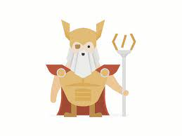

<hi>Where I document my progress doing the Odin project (03/2021)</h1>

<h2>March 30</h2>

This month I started the Odin project. First I had to install Ubuntu from a flashdrive, which was a first. It wasn't smooth sailing, but after consulting Google, everything worked out and I'm now using Ubuntu alongside Windows 10 on my laptop. I'm now doing the Foundations course and I'm reading up on HTML and CSS.

 

